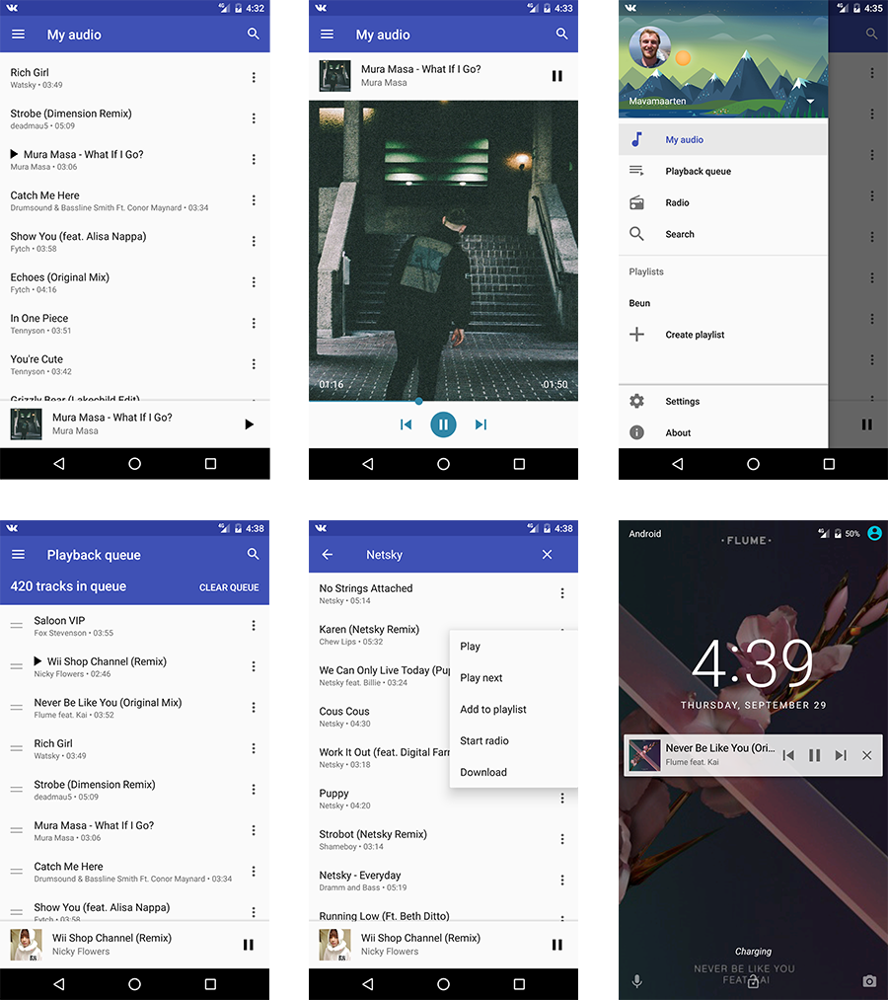

#vk Music
An android music player for vk.com, made to look like the Google Play Music app.

Vk Music has the following features:
- Your tracks
- Search
- Playlists
- Recommendations (radio)
- Notification with playback controls
- Fullscreen lockscreen background

##Used libraries

- [Dagger2](https://github.com/google/dagger) for dependency injection
- [Icepick](https://github.com/frankiesardo/icepick) for saving and restoring instance state
- [RxJava](https://github.com/ReactiveX/RxJava) & [RxAndroid](https://github.com/ReactiveX/RxAndroid)
- [Paper](https://github.com/pilgr/Paper)
- [SlidingUpPanel](https://github.com/umano/AndroidSlidingUpPanel)
- [Glide](https://github.com/bumptech/glide)
- [MaterialDrawer](https://github.com/mikepenz/MaterialDrawer)
- [Dexter](https://github.com/Karumi/Dexter)
- [Crashlytics](https://www.crashlytics.com)

It also uses
- Android Databinding
- Vector Drawables
